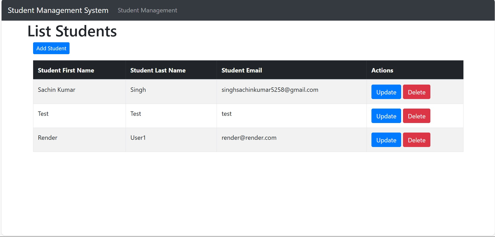
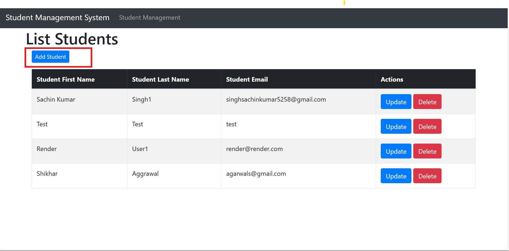
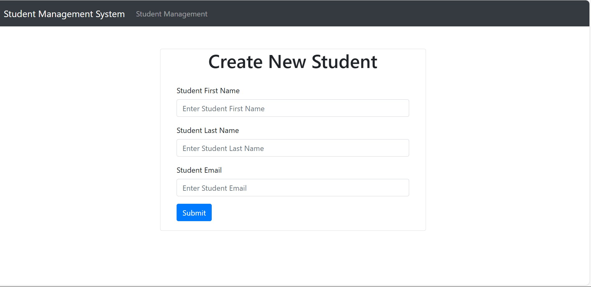
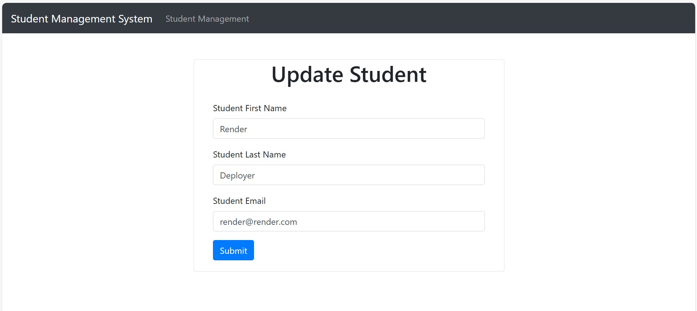
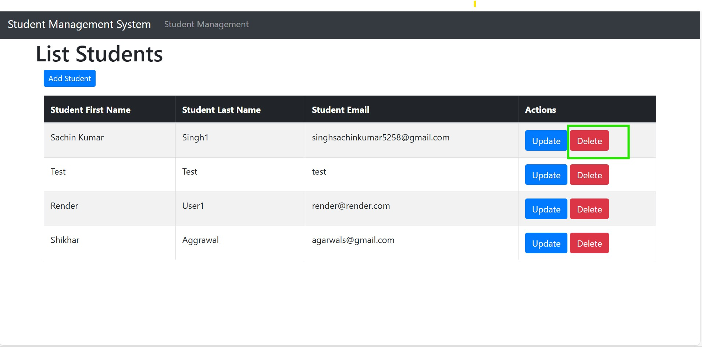

# 🎓 Student Management System

A Java-based web application for managing student records, built with Spring Boot, Thymeleaf, and MySQL. The application supports full CRUD operations and is containerized using Docker. It is deployed and accessible on Render.

## 🔗 Live Demo

👉 [Access the Application](https://student-management-system-hlrz.onrender.com/)

---

## 📌 Features

- 📝 Create, Read, Update, and Delete (CRUD) operations for student records
- 🎨 User-friendly frontend using Thymeleaf templating engine
- ⚙️ Backend developed with Spring Boot
- 🗄️ MySQL database integration for persistent storage
- 🐳 Dockerized for easy containerization and deployment
- ☁️ Hosted on Render for seamless access

---

## 🚀 Technologies Used

- **Java 17+**
- **Spring Boot**
- **Thymeleaf**
- **MySQL**
- **Docker**
- **Maven**
- **Render (for deployment)**

---

## 🛠️ Getting Started

### Prerequisites

- Java JDK 17+
- Maven
- Docker (optional for local containerization)
- MySQL (if not using Docker for DB)

### Clone the Repository

```bash
git clone https://github.com/your-username/student-management-system.git
cd student-management-system
```

### 🖥️ Run Locally (Without Docker)
1. Create the `application-<envirnomentName>.properties` file depending on the environment where you are deploying the application,e.g. `application-dev.properties` 
2. Set the active spring profile according to the environment where your application is. You can set it in the variable `spring.profiles.active=<environment name>`. e.g `spring.profiles.active=prod`
3. Define the values of the variables(used in `application.properties`) in these environment specific files.
4. Run the app:
    ```
   ./mvnw spring-boot:run
   ```
5. Access it at : `http://localhost:{portDefinedByYou}/`

### 🐳 Run with Docker
```agsl
docker build -t student-management-system .
docker run -p 8080:8080 student-management-system

```

### 🖼️ Screenshots
1. 🏠 Homepage


   


2. ✏️ Add Student


   

   

3. 🔄 Update Student


   

   

5. 🗑️  Delete Student



### 📄 License
This project is open-source and available under the MIT License.

### 🙋‍♂️ Author
Sachin Kumar Singh \
Github: kumarsachinnnn299
